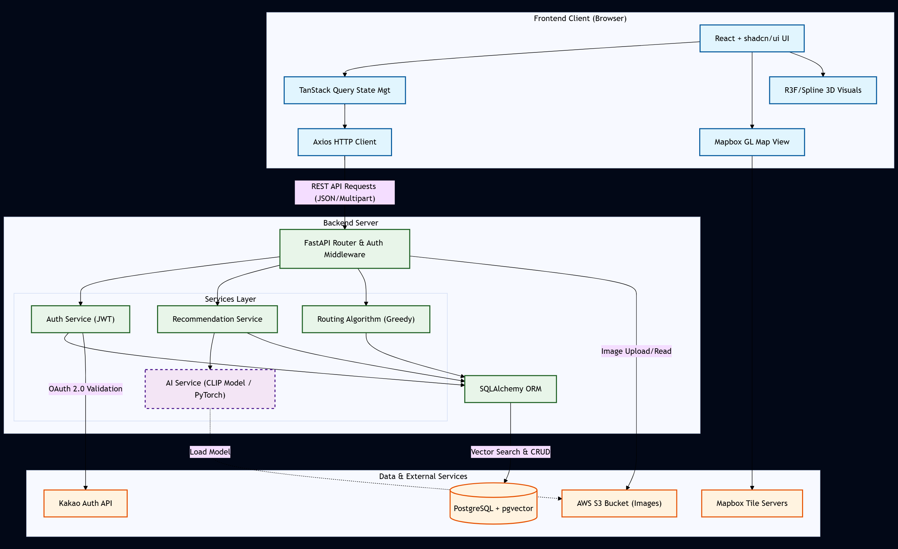

<h1 align="left">Re: Daejeon</h1>

<div align="center">
  

  <p>
    <strong>"사진으로 당신의 무드를 읽고, AI가 대전을 꿈 속의 3D 우주 도시로 재구성해<br/>
    최적의 여행 경로와 순간들을 만들어주는 인터랙티브 경험 앱"</strong>
  </p>
</div>

<br/>

## Backend Repository
[https://github.com/Osssai-52/Daejeon_AI](https://github.com/Osssai-52/Daejeon_AI)

<br/>

## Tech Stack

### Frontend
| Category | Technology | Description |
| :--- | :--- | :--- |
| **Framework** | **React 18** | 컴포넌트 기반 UI 라이브러리 (Vite 기반) |
| **Language** | **TypeScript** | 정적 타입을 통한 안정적인 로직 구현 및 생산성 향상 |
| **Styling** | **Tailwind CSS** | 유틸리티 퍼스트 CSS 프레임워크 |
| **UI Components** | **shadcn/ui** | Radix UI 기반의 재사용 가능한 컴포넌트 시스템 |
| **State Mgt** | **TanStack Query** | 서버 상태 관리 및 비동기 데이터 캐싱/동기화 |
| **Routing** | **React Router** | 클라이언트 사이드 라우팅 처리 |
| **Forms** | **React Hook Form** | 비제어 컴포넌트 기반의 고성능 폼 관리 (w/ Zod Validation) |
| **Maps** | **Mapbox GL** | WebGL 기반의 고성능 대화형 지도 렌더링 |
| **3D & Motion** | **R3F / Spline / GSAP** | React Three Fiber, Framer Motion을 활용한 인터랙티브 3D 경험 |

### Backend
| Category | Technology | Description |
| :--- | :--- | :--- |
| **Framework** | **FastAPI** | 비동기 처리(ASGI) 지원 고성능 Python 웹 프레임워크 |
| **Language** | **Python 3.11+** | 최신 문법 및 타입 힌팅 활용 |
| **Database** | **PostgreSQL** | 관계형 데이터 저장 및 관리 |
| **Vector DB** | **pgvector** | 512차원 이미지 임베딩 벡터 저장 및 코사인 유사도 검색 |
| **ORM** | **SQLAlchemy** | Python 객체와 DB 테이블 매핑 및 쿼리 관리 |
| **AI Model** | **OpenAI CLIP** | 멀티모달(텍스트-이미지) 임베딩 생성 (Hugging Face Transformers) |
| **ML Ops** | **PyTorch** | 딥러닝 모델 텐서 연산 및 추론(Inference) 실행 |
| **Storage** | **AWS S3** | 사용자 업로드 이미지 및 방문 인증샷 클라우드 저장 |
| **Auth** | **Kakao OAuth 2.0** | 소셜 로그인 인증 및 사용자 프로필 연동 |

<br/>

## System Architecture



<br/>

## Key Features

### 1. Mood-Based Place Recommendation
**"오늘의 기분을 사진 한 장으로 말해보세요."**
* 사용자가 '오늘의 무드 사진'을 선택하면, AI(CLIP)가 이미지의 분위기를 분석합니다.
* 분석된 감성과 가장 잘 어울리는 대전의 숨겨진 명소들을 자동으로 추천해줍니다.

### 2. Smart Routing & Transport Suggestion
**"어디를 먼저 갈지, 어떻게 갈지 고민하지 마세요."**
* 추천받은 장소 중 원하는 곳을 선택하면, 가장 효율적인 **최적의 여행 경로**를 만들어줍니다.
* 각 이동 구간마다 거리를 계산하여 **도보**와 **차량** 중 어떤 이동 수단이 더 좋은지 함께 제안합니다.

### 3. Route History
**"지나간 여행의 발자취를 언제든 다시 확인하세요."**
* **경로 기록 보기**를 통해 이전에 생성했던 여행 코스와 방문 리스트를 다시 볼 수 있습니다.

### 4. Memory Archiving
**"그 장소에서의 순간을 영원히."**
* 방문한 장소마다 직접 찍은 사진을 업로드하여 인증하고, 나만의 소중한 추억을 기록으로 남길 수 있습니다.

<br/>

## Developers

| [@kang022878](https://github.com/kang022878) | **Frontend & UI/UX Design** |
|:---:|:---:|
| [@Osssai-52](https://github.com/Osssai-52) | **Backend & AI Engineering** |

<br/>

## Getting Started

이 프로젝트는 백엔드와 프론트엔드가 별도의 리포지토리로 구성되어 있습니다.
전체 서비스를 실행하려면 아래 가이드를 따라 각각 설정해주세요.

### Prerequisites
* **Node.js** 18+
* **Python** 3.11+
* **PostgreSQL** (with `pgvector` extension)

### 1. Backend Setup (Server)
```bash
# 1. Clone Backend Repository
git clone https://github.com/Osssai-52/Daejeon_AI.git
cd Daejeon_AI

# 2. Virtual Environment Setup
python -m venv venv

# Mac/Linux:
source venv/bin/activate
# Windows:
# venv\Scripts\activate

# 3. Install Dependencies
pip install -r requirements.txt

# 4. Environment Variables (.env)
# 프로젝트 루트에 .env 파일을 생성하고 DB URL 및 API 키를 설정하세요.
# (DATABASE_URL, KAKAO_REST_API_KEY, SECRET_KEY, AWS_ACCESS_KEY_ID 등)

# 5. Run Server
uvicorn app.main:app --reload
```

### 2. Frontend Setup (Client)
```bash
# 1. Clone Frontend Repository
git clone https://github.com/kang022878/Daejeon_front.git
cd Daejeon_front

# 2. Install Dependencies
npm install

# 3. Run Development Server
npm run dev
```
